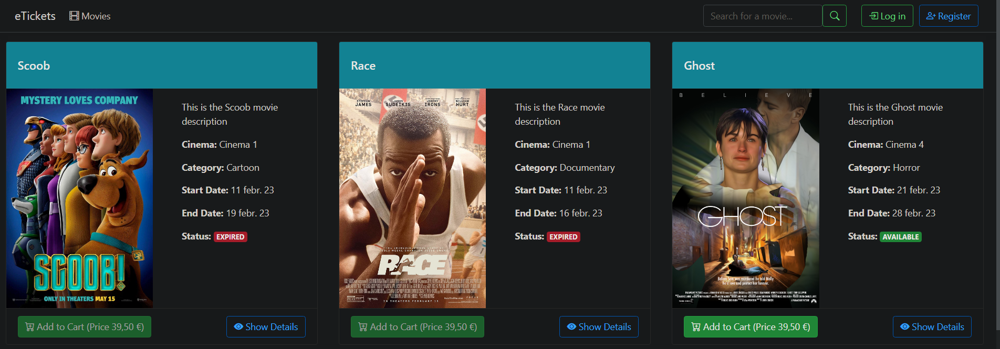
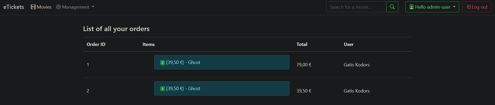
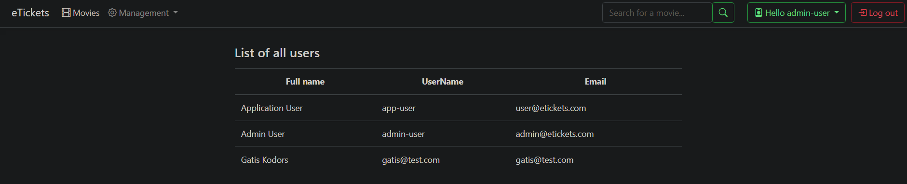

## E-Commerce Shop where you can buy movie, edit and add new ones.

## Tech 
 1. Visual Studio 2022
 2. Bootstrap (CSS framework)
 3. Entity Framework
 4. Microsoft SQL Management
 
## To Start it:
 1. Clone this repository on your PC,
 2. Open project folder, and launch eTickets.sln 
 3. Open file appsetting.json, and where is ConnectionString change 
 DataSource=YOUR_MACHINE(server)
 
 4. Open NuGet package manager console
 
 5. Type: Add-migration init
 
 6. Type: Update-database
 
 7. Ready to use and store. Press F5 to compile solution.
 
 8. To log in as admin: 
 email- admin@etickets.com
 password- Coding@1234?
 
 To log in as user:
 email- user@etickets.com
 password- Coding@1234?
 
